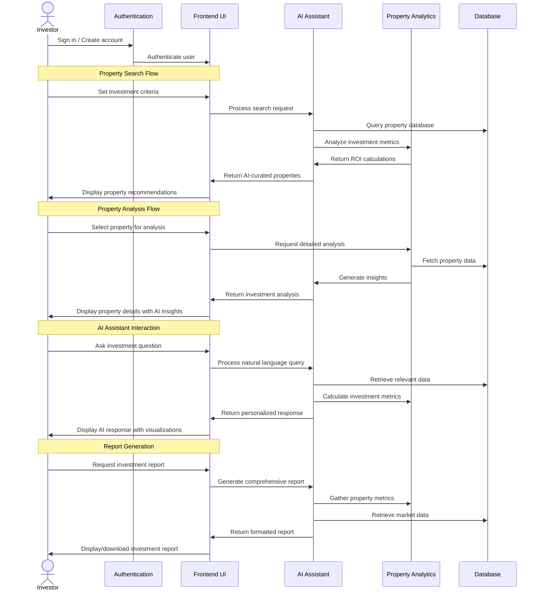

# Rentfolio AI Frontend

Rentfolio AI is an intelligent real estate investment platform that leverages artificial intelligence to provide property analytics, investment insights, and portfolio management tools for real estate investors.

## Overview

Rentfolio AI helps investors make data-driven decisions by offering:

- AI-powered property analysis and investment recommendations
- Market trend analysis and predictions
- Portfolio performance tracking and reporting
- Intelligent property search with customizable investment criteria
- Rental income and ROI forecasting

## Features

### 🏠 AI Property Intelligence

- Smart property search with investment-specific filters
- Automated property analysis with cap rate and cash-on-cash return calculations
- Real-time market data integration

### 🤖 AI Investment Assistant

- Interactive chat interface for property queries
- Intelligent answers to investment questions
- Property recommendation engine
- Report generation capabilities

### 📊 Analytics Dashboard

- Portfolio performance metrics and KPIs
- ROI tracking across properties
- Market trend visualization
- Comparative investment analysis

### 📝 Automated Reports

- Property investment analysis reports
- Portfolio performance summaries
- Market analysis documents
- Comparative property evaluations

## Application Architecture

The application is built using Next.js with TypeScript and follows a modular structure:

```
/app                   # Next.js app router pages
  /auth                # Authentication flows
  /properties          # Property listing and details
  /reports             # Reports and analytics
  /api                 # API routes
/components            # Shared UI components
  /ai                  # AI-specific components
  /layout              # Layout components
  /properties          # Property-related components
  /ui                  # Core UI components
/civitas-ai            # AI engine integration
  /src
    /components        # AI component library
    /data              # Data models and sample data
/contexts              # React context providers
/lib                   # Utility libraries
/types                 # TypeScript type definitions
```

## User Flow

The following diagram illustrates the typical user flow when interacting with the Rentfolio AI platform:



## Technology Stack

- **Frontend Framework**: Next.js with TypeScript
- **UI Components**: Custom component library with Tailwind CSS
- **State Management**: React Context API
- **AI Integration**: Custom LLM client for property analysis
- **Authentication**: NextAuth.js
- **Styling**: Tailwind CSS with custom UI components

## Getting Started

1. Clone the repository
2. Install dependencies: `npm install`
3. Set up environment variables
4. Run development server: `npm run dev`
5. Access the application at `http://localhost:3000`

## License

[License information]

## Contact

[Contact information]
