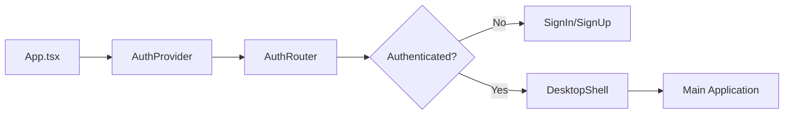
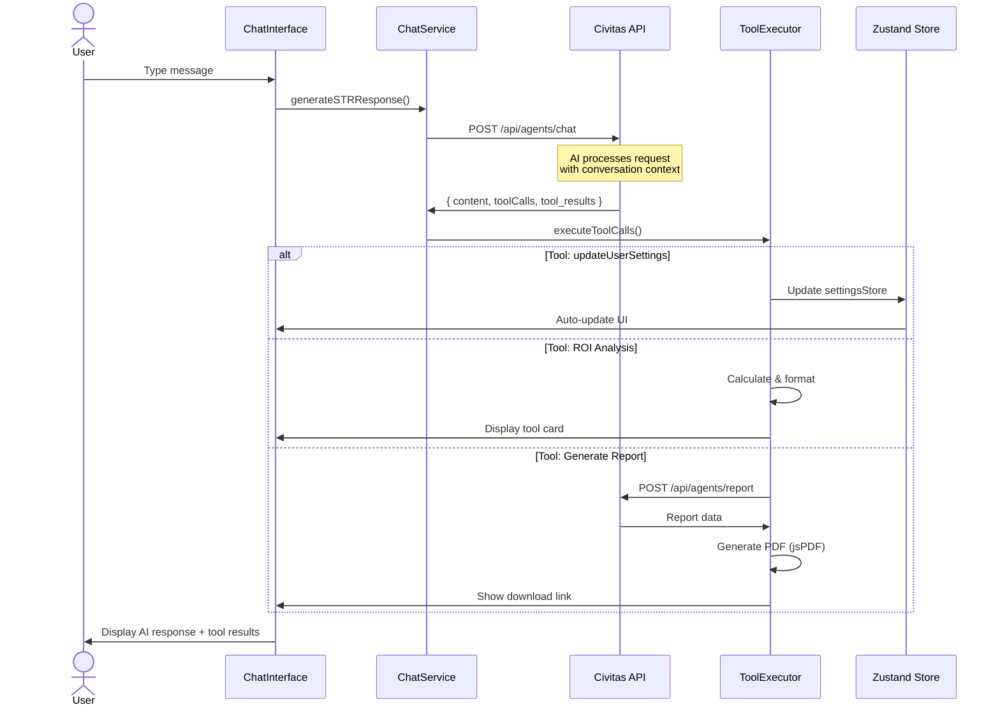

# Civitas AI Frontend

**Civitas AI** is an intelligent real estate investment platform built with React + Vite that leverages artificial intelligence to provide property analytics, investment insights, and portfolio management tools through a conversational interface.

## Overview

Civitas AI helps investors make data-driven decisions through:

- **Conversational AI Assistant** - Natural language interface for all platform features
- **Tool-Augmented Responses** - AI agent executes tools (ROI calculations, market analysis, property comparisons)
- **Dynamic Report Generation** - Automated investment reports with PDF export
- **Market Intelligence** - Real-time market trends, KPIs, and investment insights
- **Portfolio Management** - Track and analyze investment properties and performance
- **Customizable Settings** - Theme, preferences, and notifications manageable through conversation

## Key Features

### 💬 Conversational AI Interface

- **Chat-First Design** - Natural language interaction for all platform features
- **Tool Execution** - AI agent executes tools in real-time (ROI analysis, market data, property comparisons, alerts)
- **Contextual Responses** - Maintains conversation history and user context
- **Smart Suggestions** - Intelligent follow-up questions and action recommendations
- **Settings Management** - Update preferences conversationally (e.g., "turn off email notifications")

### 🏠 Property Intelligence

- **Property Search** - Investment-specific filters for property discovery
- **Automated Analysis** - Cap rate, cash-on-cash returns, and investment metrics
- **Market Data Integration** - Real-time market trends and comparable properties
- **Portfolio Tracking** - Manage and analyze investment property portfolios

### 📊 Market Intelligence

- **Market Trends** - Visualize market data with interactive charts (Recharts)
- **KPI Tracking** - Monitor key investment metrics and performance indicators
- **Comparative Analysis** - Compare properties and market segments
- **Investment Insights** - AI-generated insights based on market conditions

### � Report Generation

- **Automated Reports** - AI-generated investment analysis documents
- **PDF Export** - Professional reports with charts and tables (jsPDF + html2canvas)
- **Multiple Report Types** - Market analysis, portfolio summaries, ROI analysis, comparative analysis
- **Report Management** - Save, organize, and access historical reports

## Application Architecture

Built with **React 19 + Vite 7 + TypeScript 5.8** following a highly modular, component-driven architecture.

### Project Structure

```plaintext
civitas-ai/
├── src/
│   ├── components/              # UI Components (modular, single-responsibility)
│   │   ├── auth/               # Authentication (SignIn, SignUp)
│   │   ├── chat/               # Chat interface components
│   │   │   ├── ChatInterface.tsx
│   │   │   ├── MessageBubble.tsx
│   │   │   ├── Composer.tsx
│   │   │   ├── ToolCard.tsx
│   │   │   └── tool-cards/     # Specialized tool result cards
│   │   ├── desktop-shell/      # Main app shell components
│   │   ├── views/              # Tab view components
│   │   │   ├── PropertiesTabView.tsx
│   │   │   ├── PortfolioTabView.tsx
│   │   │   ├── MarketTrendsTabView.tsx
│   │   │   └── ReportsTabView.tsx
│   │   └── common/             # Shared UI components
│   │
│   ├── hooks/                  # Custom React hooks (state management)
│   │   ├── useDesktopShell.ts  # Main app state (258 lines)
│   │   ├── useChatState.ts     # Chat history persistence
│   │   ├── useThemeState.ts    # Theme management
│   │   ├── usePreferences.ts   # User preferences
│   │   └── useLayout.ts        # Layout state
│   │
│   ├── services/               # Business logic & API integration
│   │   ├── ChatService.ts      # Chat API integration
│   │   ├── agentsApi.ts        # Backend agents API
│   │   └── toolExecutor.ts     # Tool execution logic
│   │
│   ├── contexts/               # React Context providers
│   │   ├── AuthContext.tsx     # Authentication state
│   │   └── PortfolioContext.tsx
│   │
│   ├── stores/                 # Zustand stores (global state)
│   │   ├── reportsStore.ts     # Report management
│   │   └── settingsStore.ts    # Settings persistence
│   │
│   ├── types/                  # TypeScript definitions
│   │   ├── enums.ts           # Type-safe enums (15+ enums)
│   │   ├── chat.ts            # Chat-related types
│   │   └── index.ts           # Core types
│   │
│   ├── layouts/                # Layout shells
│   │   ├── DesktopShell.tsx   # Main app (228 lines, from 1,371)
│   │   └── DemoShell.tsx      # Demo mode
│   │
│   └── utils/                  # Utility functions
│       ├── toolExecution.ts   # Tool execution helpers
│       └── chatHandlers.ts    # Chat CRUD operations
│
└── docs/                       # Documentation
    ├── FINAL_REFACTORING_COMPLETE.md
    ├── ENUM_INTEGRATION_COMPLETE.md
    └── BACKEND_INTEGRATION.md
```

### Architecture Highlights

#### 🎯 Refactored for Maintainability
- **DesktopShell.tsx**: Reduced from 1,371 lines to 228 lines (83% reduction)
- **19+ focused modules** extracted: hooks, services, components
- **Single Responsibility Principle** applied throughout

#### 🔧 Type-Safe Enums
- 15+ enums for complete type safety (`ReportStatus`, `ToolKind`, `MessageRole`, etc.)
- Zero magic strings, full IDE autocomplete
- Runtime iteration with zero runtime cost

#### 🎨 Desktop-Style Interface
- Tab-based navigation (Chat, Market, Reports, Settings)
- Sidebar with chat history
- State-specific theme colors (California, Texas, Florida, etc.)
- Desktop-first responsive design

## Application Flow

### Authentication Flow



### Chat Interaction Flow



### Key User Flows

**1. Chat-Driven Property Analysis**

- User: "Analyze 123 Main St for investment potential"
- AI executes: `ROIAnalysis`, `MarketData`, `PropertyComparison` tools
- Results displayed as interactive tool cards with visualizations

**2. Conversational Settings**

- User: "Enable dark mode and turn off email notifications"
- AI calls: `updateUserSettings({ theme: 'dark', emailNotifications: false })`
- Settings update immediately via Zustand store

**3. Report Generation**

- User: "Create a market analysis report for Austin"
- AI generates report with charts and tables
- User previews and downloads as PDF

## Technology Stack

### Core

- **Framework**: React 19.1.1 + Vite 7.1.2
- **Language**: TypeScript 5.8.3
- **Build Tool**: Vite with Fast Refresh

### UI & Styling

- **Styling**: Tailwind CSS 3.4.17 + PostCSS + Autoprefixer
- **Icons**: Lucide React 0.544.0
- **Animations**: Framer Motion 12.23.24
- **Forms**: @tailwindcss/forms 0.5.10
- **Utilities**: clsx, tailwind-merge, class-variance-authority

### State Management

- **Global State**: Zustand 5.0.8 (settings, reports)
- **Context**: React Context API (auth, portfolio)
- **Custom Hooks**: Extensive hook-based architecture

### Data Visualization & Reports

- **Charts**: Recharts 3.3.0
- **PDF Generation**: jsPDF 3.0.3 + jsPDF-autotable 5.0.2
- **Screenshots**: html2canvas 1.4.1

### Backend Integration

- **API**: REST API with Civitas backend
- **Endpoints**: `/api/agents/chat`, `/api/agents/report`
- **Tool Execution**: Client-side tool executor for AI-driven actions

### Code Quality

- **Linting**: ESLint 9.33.0 + TypeScript ESLint 8.39.1
- **Type Safety**: Strict TypeScript with 15+ type-safe enums

## Getting Started

### Prerequisites

- Node.js 18+ (recommended: 20+)
- npm or yarn

### Installation

```bash
# Navigate to the civitas-ai directory
cd civitas-ai

# Install dependencies
npm install

# Set up environment variables (create .env file)
echo "VITE_CIVITAS_API_URL=http://localhost:8000" > .env
echo "VITE_DEV_MODE=true" >> .env

# Run development server
npm run dev

# Open browser to http://localhost:5173
```

### Available Scripts

```bash
npm run dev      # Start dev server with hot reload (port 5173)
npm run build    # Build for production (TypeScript + Vite)
npm run preview  # Preview production build
npm run lint     # Run ESLint
```

### Development Mode

Set `VITE_DEV_MODE=true` to enable experimental features:

- 🧪 Properties tab (in development)
- 🧪 Portfolio tab (in development)

**Keyboard Shortcuts**:

- `Alt+D` - Toggle between main and demo views

## Backend Integration

The frontend expects a Civitas backend API at `VITE_CIVITAS_API_URL`:

- `POST /api/agents/chat` - Conversational AI with tool execution
- `POST /api/agents/report` - Report generation

See `BACKEND_INTEGRATION.md` for detailed API specifications.

## Project Documentation

- `FINAL_REFACTORING_COMPLETE.md` - Refactoring summary (83% code reduction)
- `ENUM_INTEGRATION_COMPLETE.md` - Type-safe enum implementation
- `BACKEND_INTEGRATION.md` - API integration guide
- `ANIMATION_SYSTEM.md` - Animation guidelines
- `MARKET_TRENDS_DATA_SPEC.md` - Market data specifications

## Repository Info

- **Owner**: Rentfolio-ai
- **Repository**: Frontend
- **Branch**: main
- **License**: Proprietary
